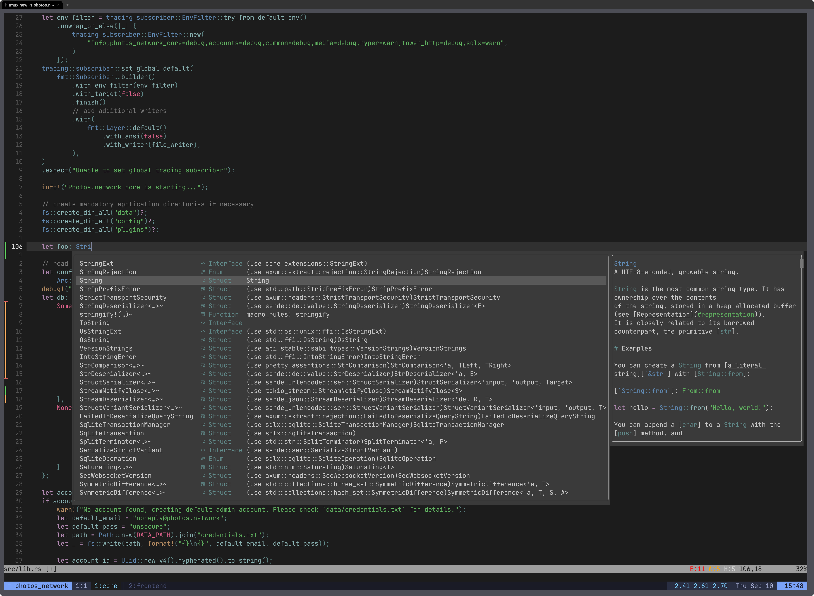

# dotfiles

The files in this repositories are dotfiles and Manifest files managed by [comtrya](https://github.com/comtrya/comtrya).

> Comtrya allows to configure and **provision** the system with these files.


## 🔧 Installation
To install [comtrya](https://www.comtrya.dev/getting-started/installation) run the installation script or download it from their page.
```shell
curl -fsSL https://get.comtrya.dev | sh
```


## 🌱 Provisioning
Provisioning a specific manifest or a subset
```shell
comtrya -d https://github.com/thebino/dotfiles apply -m apps.nvim
```

Provisioning **all** manifests from the repository
```shell
comtrya -d https://github.com/thebino/dotfiles apply
```

### 🍏 from Scratch

To install a system from scratch, some prerequisites are required to start the provisioning.
```shell
xcode-select --install
```
Install [Homebrew](https://brew.sh/) on the system.

Install GnuPG and import the private key
```shell
comtrya -d https://github.com/thebino/dotfiles apply -m apps.gnupg
/opt/homebrew/bin/gpg --import private_key.asc
export GPG_TTY=$(tty)
```


## ⚠️ Configuration
 `{{ user.config_dir }}` on Mac is refering to `~/Library/Application Support/<appname>/` it might be necessary to use `{{ user.home_dir }}/.config` for some apps instead.


## 🔐 Encryption
Instead of the build-in encryption with [age](https://crates.io/crates/age) some configuration files are encrypted using GPG and are decrypted during the provisioning.

Encryption
```shell
$ gpg --output input.gpg --encrypt --armor input.txt
```

Decryption
```shell
$ gpg --output output.txt --decrypt input.gpg
```


## 📝 neovim



```sh
sudo apt remove --purge neovim
ARCH=$(uname -m)
[ "$ARCH" = "aarch64" ] && ARCH=arm64

curl -LO "https://github.com/neovim/neovim/releases/download/stable/nvim-linux-$ARCH.tar.gz"
tar xzf "nvim-linux-$ARCH.tar.gz"
sudo mv "nvim-linux-$ARCH" /opt/nvim
```

## Plugins
### Ui
 - **Theme** [tokyonight.nvim](https://github.com/folke/tokyonight.nvim)
 - **Syntax Highlighting** [nvim-treesitter](https://github.com/nvim-treesitter/nvim-treesitter)
 - **Git blame** inline [gitsigns.nvim](https://github.com/lewis6991/gitsigns.nvim)
 - **Keybingings popup** [which-key.nvim](https://github.com/folke/which-key.nvim) `<leader>` shows popup with keybingings

### Typing
 - **Autocompletion** [nvim-cmp](https://github.com/hrsh7th/nvim-cmp) auto-completion `_s` shows popup with snippets
 - **Snippets** [LuaSnip](https://github.com/L3MON4D3/LuaSnip) provides
   automatic expansion for templates

### Files
   - **Fuzy Finder** [telescope.nvim](https://github.com/nvim-telescope/telescope.nvim) `_ff` for files, `_fg` for live grep
 - **File Browser** [neo-tree](https://github.com/nvim-neo-tree/neo-tree.nvim) `_fe` open/close, `_e` focus

### Languages
 - **Rust** [crates.nvim](https://github.com/Saecki/crates.nvim) Manage crates.io dependencies
 - **Latex** [vimtex](https://github.com/lervag/vimtex) Software system for typesetting `_ll` start compile, `_lv` view pdf 


## Minimal
~/.config/nvim/init.vim
```
colorscheme slate
set termguicolors
set number relativenumber
set scrolloff=8
set showmatch
set nowrap
set list
set listchars=tab:┈\ ,leadmultispace:·,extends:»,precedes:«
set laststatus=2
set statusline=[%n]\ %<%F\ %m%r%h%w\ %=%-15.(%l,%c%V%)\ %p%%
```
