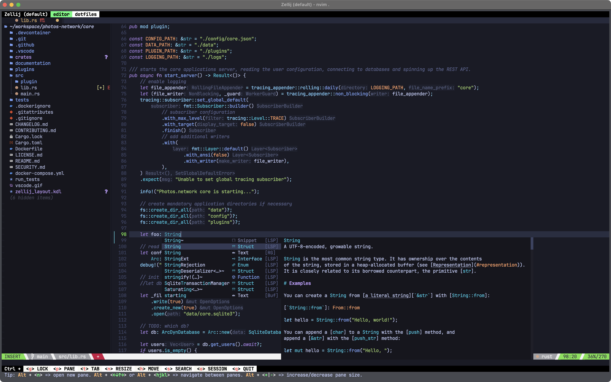

# dotfiles

The files in this repositories are dotfiles and Manifest files managed by [comtrya](https://github.com/comtrya/comtrya).
Comtrya allows to configure and provision the system with these files.


## Installation
To install [comtrya](https://www.comtrya.dev/getting-started/installation) run the installation script or download it from their page.
```shell
curl -fsSL https://get.comtrya.dev | sh
```

#### Manual installation
🚨 Due to an issue [#337](https://github.com/comtrya/comtrya/issues/337) a manual installation might be needed!

```shell
git clone https://github.com/comtrya/comtrya.git
cargo build --release
./target/release/comtrya
```


## ⚠️ Side-effects
`{{ user.config_dir }}` on Mac is refering to `~/Library/Application Support/<appname>/` it might be necessary to use `{{ user.home_dir }}/.config` for some apps instead.


## Provisioning
Provisioning **all** from repository
```shell
comtrya -d https://github.com/thebino/dotfiles apply
```

Provisioning a specific manifest or a subset
```shell
comtrya -d https://github.com/thebino/dotfiles apply -m apps.git
```


## Encryption
Some configuration files are encrypted using GPG and are decrypted by comtrya during the provisioning.

Encryption
```shell
$ gpg --output input.gpg --encrypt --armor input.txt
```

Decryption
```shell
$ gpg --output output.txt --decrypt input.gpg
```


# Editor
To have the same look from NeoVim in Helix, needed ~900 less lines of configurations.

```
nvim: 1055 loc configuration
hx: 150 loc configuration
```

| nvim       | helix           |
| ------------- |:-------------:|
|  |  |

## neovim
### Ui
 - **Theme** [tokyonight.nvim](https://github.com/folke/tokyonight.nvim)
 - **Syntax Highlighting** [nvim-treesitter](https://github.com/nvim-treesitter/nvim-treesitter)
 - **Tabbar** at the top [barbar.nvim](https://github.com/nanozuki/tabby.nvim/) `_bn` next buffer, `_bp` prev buffer
 - **Status** at the bottom [lualine.nvim](https://github.com/nvim-lualine/lualine.nvim)
 - **Git blame** inline [gitsigns.nvim](https://github.com/lewis6991/gitsigns.nvim)
 - **Cursor Highlighting** [cursorline](https://github.com/yamatsum/nvim-cursorline)
 - **Keybingings popup** [which-key.nvim](https://github.com/folke/which-key.nvim) `<leader>` shows popup with keybingings


### Files
 - **File Browser** [neo-tree](https://github.com/nvim-neo-tree/neo-tree.nvim) `_tt` open/close, `_tf` focus
 - **Fuzy Finder** [telescope.nvim](https://github.com/nvim-telescope/telescope.nvim) `_ff` for files, `_fb` for buffers
 - **Git** [lazygit.nvim](https://github.com/kdheepak/lazygit.nvim) `_lg` lazygit in a floating window

### Typing
 - **Autopairs** [nvim-autopairs](https://github.com/windwp/nvim-autopairs) adds matching brachets
 - **Change parenthesses** [vim-surround](https://github.com/tpope/vim-surround) `cs '"` inside a \"
 - **Fast motion** [leap.nvim](https://github.com/ggandor/leap.nvim) Fast motion press `s` and any character
 - **Autocompletion** [nvim-cmp](https://github.com/hrsh7th/nvim-cmp) auto-completion


### Languages
 - **Debug adapters** [nvim-dap](https://github.com/mfussenegger/nvim-dap) Debug adapter `Space + d`
 - **Go** [go.nvim](https://github.com/ray-x/go.nvim) Go language features
 - **Rust** [rustaceanvim](https://github.com/mrcjkb/rustaceanvim) Rust tools
 - **Markdown** [glow.nvim](https://github.com/ellisonleao/glow.nvim) Markdown Preview


### Misc
 - **Autocompletion** [nvim-cmp](https://github.com/hrsh7th/nvim-cmp) auto-completion during typing
 - **Startup** [dashboard-nvim](https://github.com/nvimdev/dashboard-nvim) List of recent files and projects
